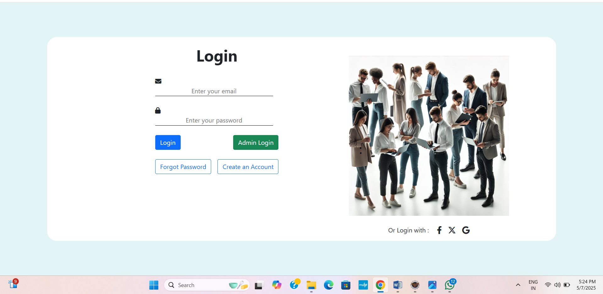
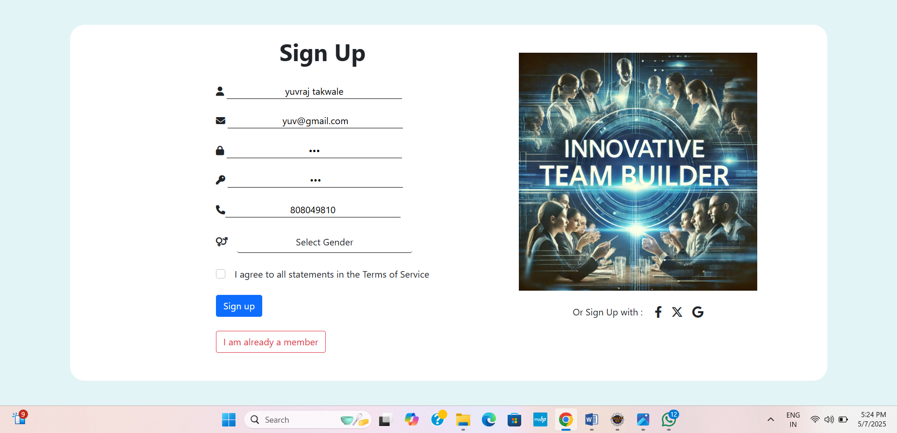
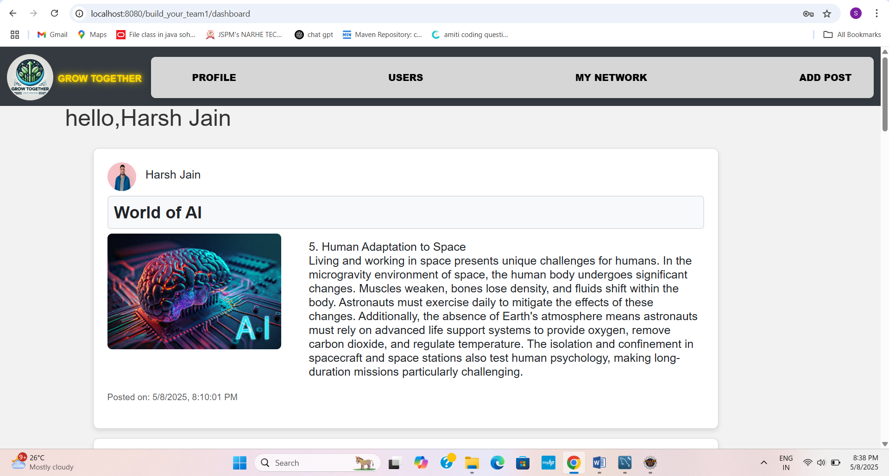
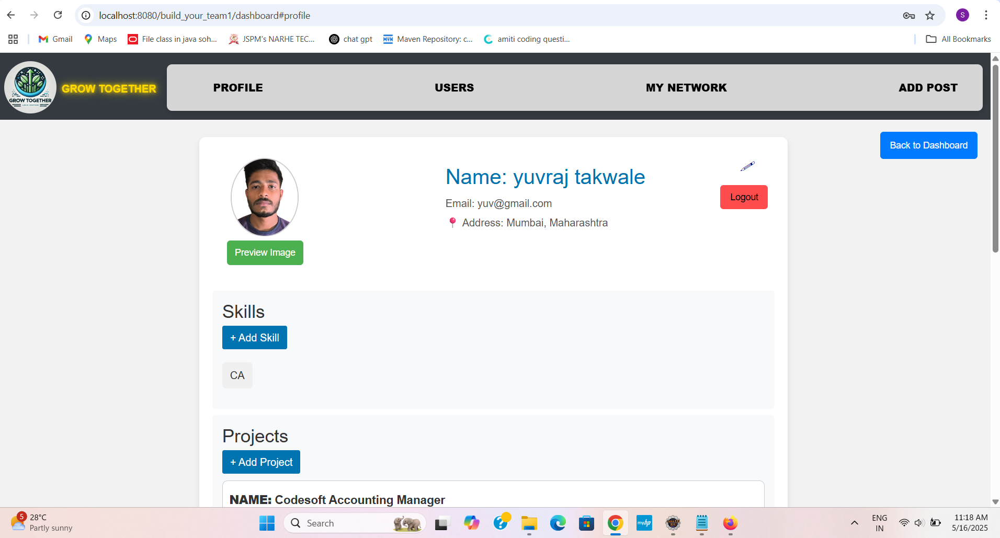
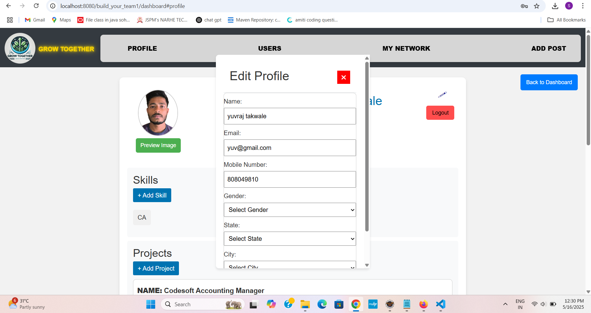
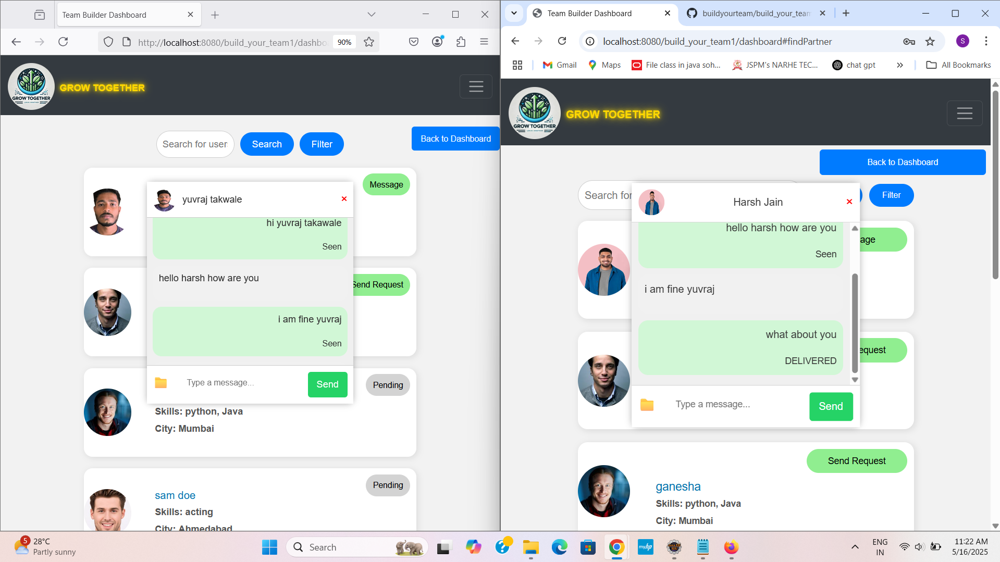
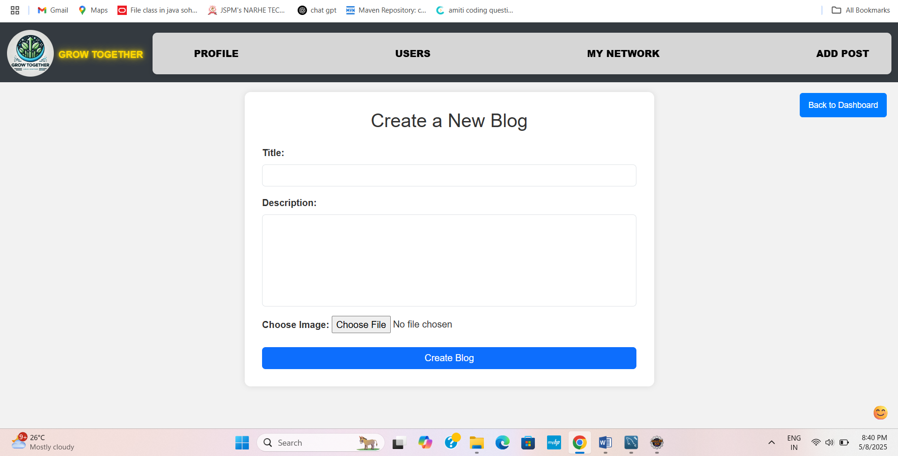
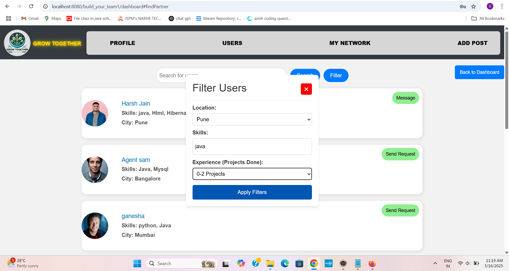
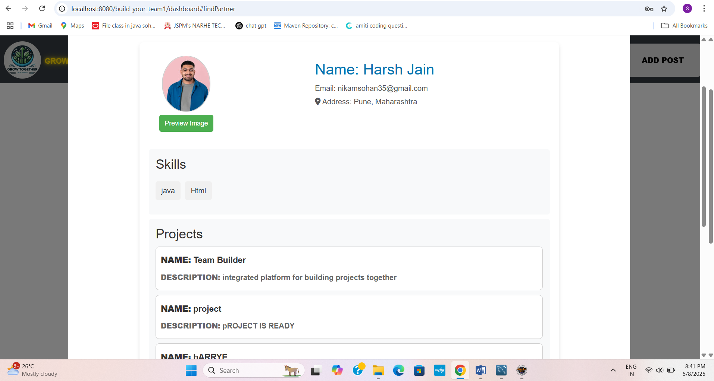

# 📚 Project Collaborator Hub

A web-based platform designed to help final-year students find ideal project partners based on skills, interests, and compatibility. 
The system enables real-time messaging,connecting to Users, profile creation, project posting, and structured collaboration.
---
## 💡 Features

- Create and edit student profiles with skills, education,certifications and projects experience.
- Send, accept, or reject collaboration requests.
- Real-time messaging via WebSocket after connection is accepted.
- Add and view posts from other users in the dashboard.
- Browse other users and manage your network.
- Search users based on filter(skills,project experience,location)
- Secure login and registration with validations.
- Clean and responsive frontend design.
- Developed using modular, scalable backend architecture.
---

## 🛠️ Technologies Used

**Backend:**
- Spring MVC 
- Hibernate ORM  
- MySQL  
- WebSockets (for real-time chat)

**Frontend:**
- HTML  
- CSS  
- JavaScript  
- JSON (for API interaction)
---

## 📸 Screenshots

> ```

> 
> 
> 
> 
> 
> 
> 
> .png)
> 
> 
> 

> ```
---

## 🚀 Installation Steps

1. **Clone the Repository**  
   ```bash
   git clone https://github.com/yourusername/buildyourteam.git
   ```

2. **Open the project folder in Eclipse IDE**

3. **Update the Database Configuration**  
   Modify the `spring-servlet.xml` file with your local MySQL database credentials.

4. **Configure Apache Tomcat 9 Server**

5. **Run the Application**  
   Launch it in your browser using Tomcat (e.g., `http://localhost:8080/build_your_team1/login`)

---

## 👨‍💻 Developed By

**Sohan Nikam**
---

## 📜 License

This project is licensed under the **MIT License** – see the [LICENSE](LICENSE) file for details.
---

## ⚠️ Project Status

🚧 **Currently Under Development** – Features may change and evolve. Contributions are welcome!

---
